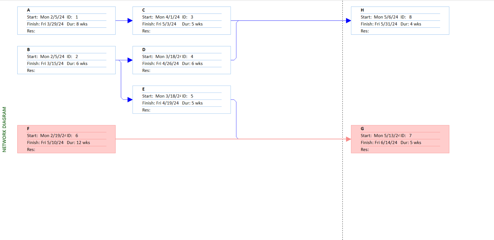
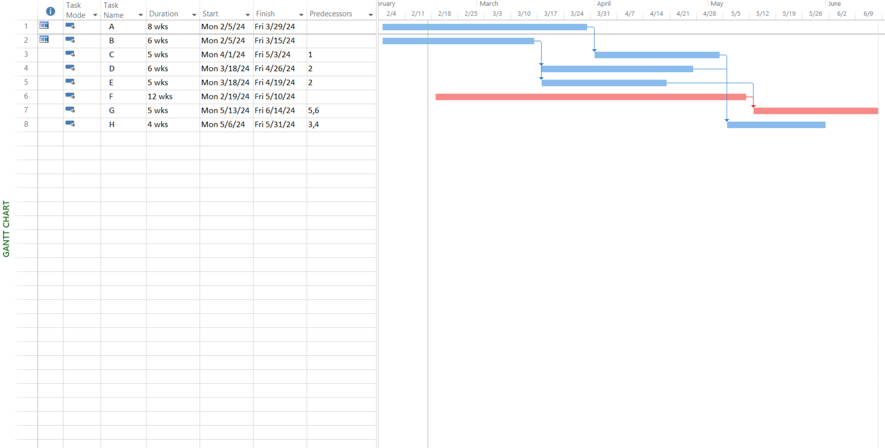

# Lab 01

## Prepare the Activity Schedule, Gantt Chart, and Network Diagram using MS Project. (Considering the following table of information for CPM).

| Activity | Duration(week) | Precedents |
| :------: | :------------: | :--------- |
|    A     |       8        | None       |
|    B     |       6        | None       |
|    C     |       5        | A          |
|    D     |       6        | B          |
|    E     |       5        | B          |
|    F     |       12       | None       |
|    G     |       5        | E, F       |
|    H     |       4        | C, D       |

