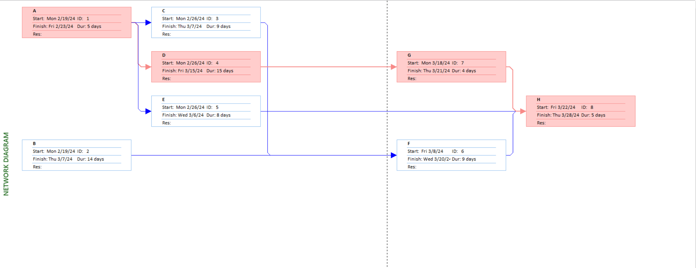
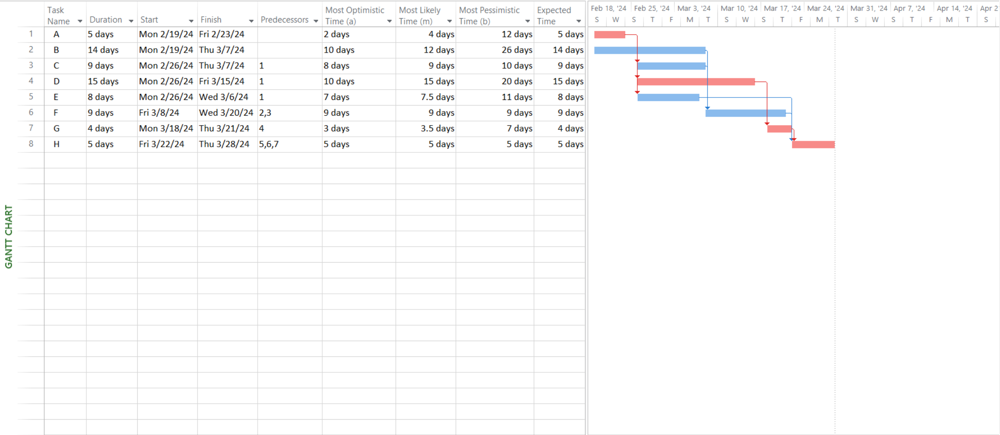

# Lab 02

## Prepare the Activity Schedule, Gantt Chart, and Network Diagram using MS Project. (Considering the following table of information for CPM).

| Activity | Precedents | Most Optimistic Time (a) | Most Likely Time (m) | Most Pessimistic Time(b) |
| :------: | :--------: | :----------------------: | :------------------: | :----------------------: |
|    A     |    None    |            2             |          4           |            12            |
|    B     |    None    |            10            |          12          |            26            |
|    C     |     A      |            8             |          9           |            10            |
|    D     |     A      |            10            |          15          |            20            |
|    E     |     A      |            7             |         7.5          |            11            |
|    F     |    B, C    |            9             |          9           |            9             |
|    G     |     D      |            3             |         3.5          |            7             |
|    H     |   E,F,G    |            5             |          5           |            5             |

