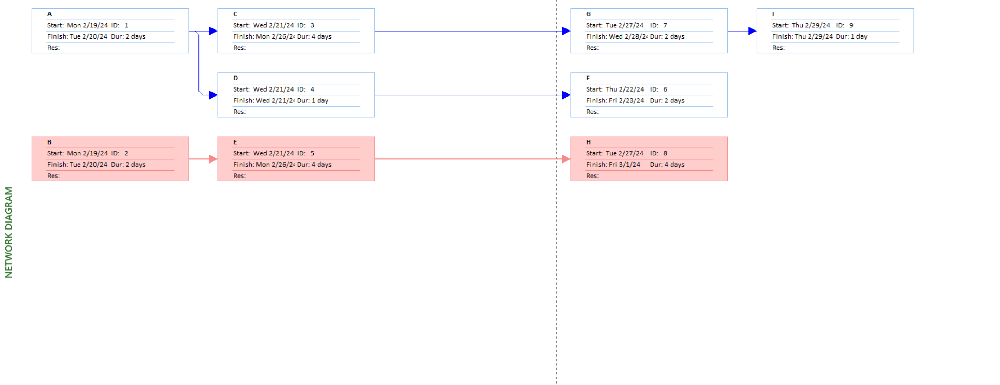
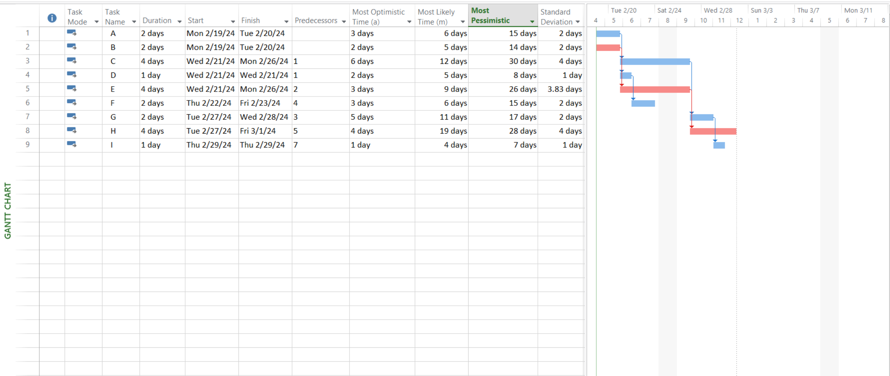

# Lab 03

## Prepare the Activity Schedule, Gantt Chart, and Network Diagram using MS Project. (Considering the following table of information for CPM).

| Activity | Precedents | Most Optimistic Time (a) | Most Likely Time (m) | Most Pessimistic Time(b) |
| :------: | :--------: | :----------------------: | :------------------: | :----------------------: |
|    A     |    None    |            3             |          6           |            15            |
|    B     |    None    |            2             |          5           |            14            |
|    C     |     A      |            6             |          12          |            30            |
|    D     |     A      |            2             |          5           |            8             |
|    E     |     B      |            3             |          9           |            26            |
|    F     |     D      |            3             |          6           |            15            |
|    G     |     C      |            5             |          11          |            17            |
|    H     |     E      |            4             |          19          |            28            |
|    I     |     G      |            1             |          4           |            7             |

