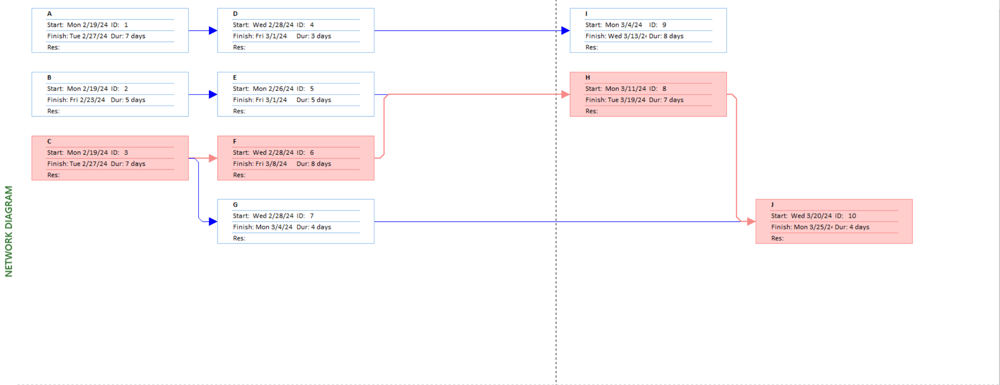
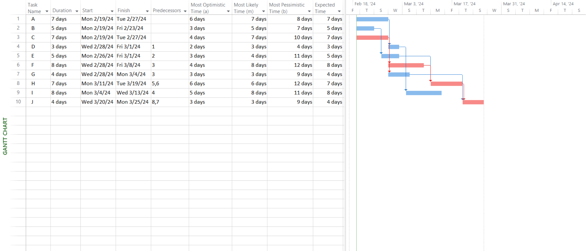

# Lab 04

## Prepare the Activity Schedule, Gantt Chart, and Network Diagram using MS Project. (Considering the following table of information for CPM).

| Activity | Precedents | Most Optimistic Time (a) | Most Likely Time (m) | Most Pessimistic Time(b) |
| :------: | :--------: | :----------------------: | :------------------: | :----------------------: |
|    A     |    None    |            6             |          7           |            8             |
|    B     |    None    |            3             |          5           |            7             |
|    C     |    None    |            4             |          7           |            10            |
|    D     |     A      |            2             |          3           |            4             |
|    E     |     B      |            3             |          4           |            11            |
|    F     |     C      |            4             |          8           |            12            |
|    G     |     C      |            3             |          3           |            9             |
|    H     |    E, F    |            6             |          6           |            12            |
|    I     |     D      |            5             |          8           |            11            |
|    J     |    H, G    |            3             |          3           |            9             |

