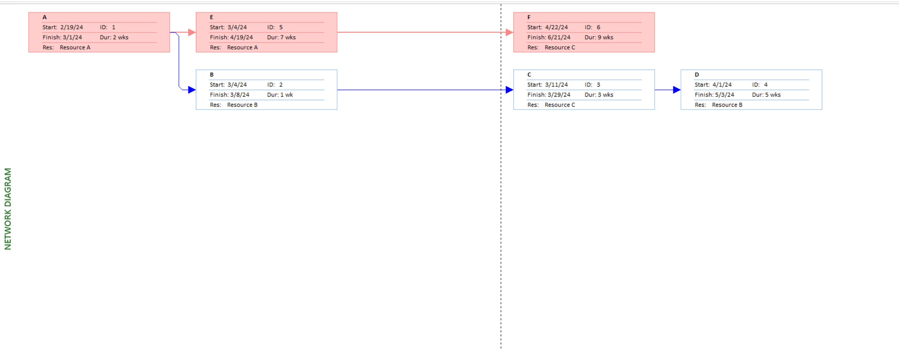
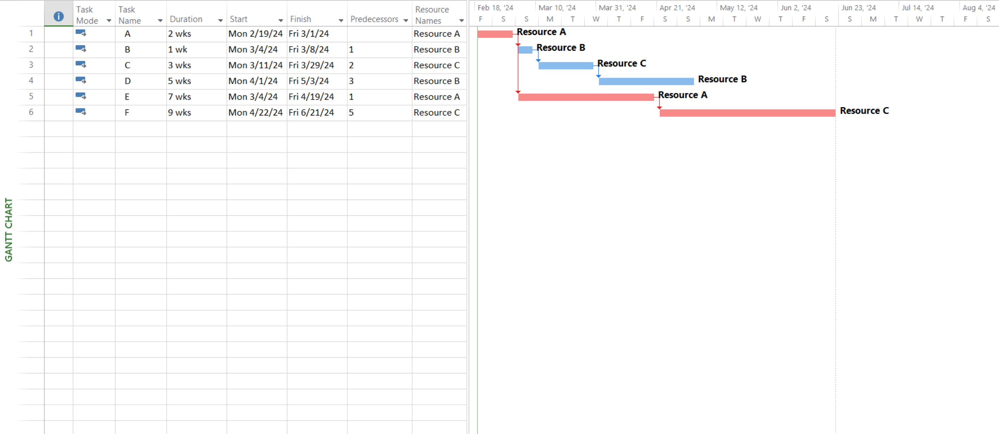

# Lab 05

## Prepare the Activity Schedule, Gantt Chart, and Network Diagram using MS Project. (Considering the following table of information for CPM).

| Activity | Precedents | Duration(weeks) |
| :------: | :--------: | :-------------: |
|    A     |    None    |        2        |
|    B     |     A      |        1        |
|    C     |     B      |        3        |
|    D     |     C      |        5        |
|    E     |     A      |        7        |
|    F     |     E      |        9        |

