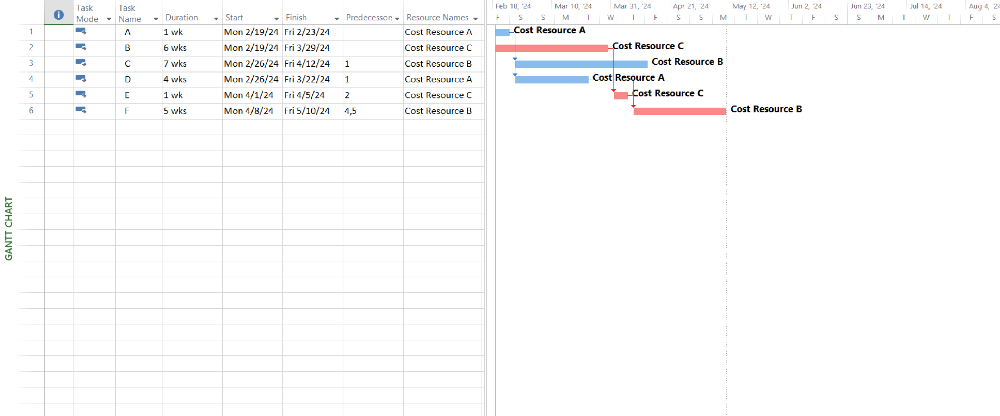

# Lab 06

## Prepare the Activity Schedule, Gantt Chart, and Network Diagram using MS Project. (Considering the following table of information for CPM).

| Activity | Precedents | Duration(weeks) |
| :------: | :--------: | :-------------: |
|    A     |    None    |        1        |
|    B     |    None    |        6        |
|    C     |     A      |        7        |
|    D     |     A      |        4        |
|    E     |     B      |        1        |
|    F     |    D, E    |        5        |

