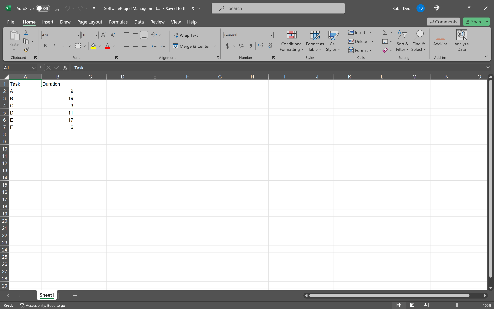
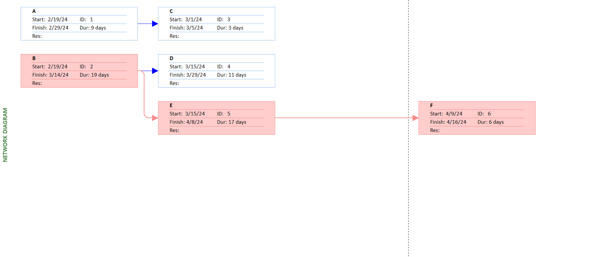
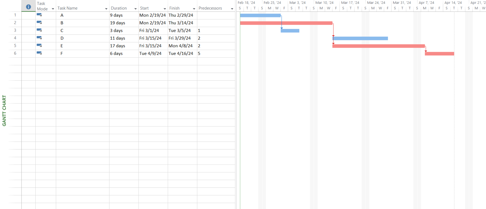

# Lab 07

## Prepare the Activity Schedule, Gantt Chart, and Network Diagram using MS Project. (Considering the following table of information for CPM).

| Activity | Precedents | Duration(days) |
| :------: | :--------: | :------------: |
|    A     |    None    |       9        |
|    B     |    None    |       19       |
|    C     |     A      |       3        |
|    D     |     B      |       11       |
|    E     |     B      |       17       |
|    F     |     E      |       6        |

